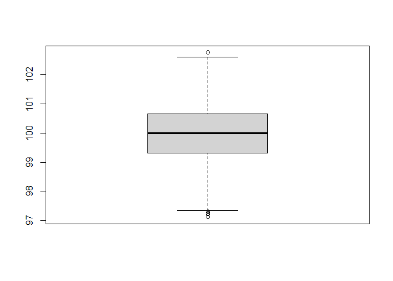

<!-- README.md is generated from README.Rmd. Please edit that file -->

# wafR 

<!-- badges: start -->
<!-- badges: end -->

The goal of wafR is to provide data management and graphing according to
the Margules Groome style guide. This package was originally developed
for outputs from the New Zealand Wood Availability Forecasts produced by
Margules Groome for the NZ Ministry for Primary Industries (MPI) but has
now been extended to include other functions. The Margules Groome team
may find these functions useful for more general graphing in the house
style.

The package has been updated to include growth and yield functions that
might be commonly used by the Margules Groome team.

The following is a list of package functions. More functions are being
regularly added.

-   General forest inventory functions

    -   mth - Calculates mean top height given a set of tree heights
    -   pdh - Calculates predominant height
    -   spha - calculates the stems per hectare for an inventory plot
    -   thpa - Calculates the trees per hectare for an inventory plot
    -   QMD - Calculates the quadractic mean DBH.
    -   ba - Calculates the basal area for a plot given a series of DBH
        values and a plot size (ha)
    -   RMSE - Calculates the root mean square error (RMSE) given a set
        of predictions and actual values. Useful for assessing model
        performance.
    -   std.err - Calculates the standard error of a set of samples.
    -   conf.int - Calculates the confidence limit around the mean at
        the 95% confidence level.
    -   ple - Calculates the probable limit of error (PLE) for a set of
        samples. These might be plot level estimates of volume in a
        forest inventory.
    -   is\_outlier - Identifes outliers in a population.
    -   

-   Graphing helpers

    -   themeMagGroome - Applies the Margules Groome mapping theme to a
        ggplot object.
    -   scale\_fill\_MagGroome - Applies the Margules Groome colour
        palette to the fill argulment in a ggplot object when graphing.
    -   scale\_colour\_MagGroome - Applies the Margules Groome colour
        palette to the colour argulment in a ggplot object when
        graphing.
    -   shift\_legend - Will shift the legend to occupy empty panels in
        a facetted plot.
    -   MG\_save - saves a ggplot object as a figure suitable for
        insertion into a Margules Groome report
    -   MagGroome\_cols - Returns the Margules Groome colours
    -   MagGroome\_pal - Returns the Margules Groome colour palette

-   Volume and Taper Functions

    -   Schumacher and Hall tree volume functions with coefficients from
        SA forestry handbook
    -   Max and Burkhart taper function with coefficients from SA
        forestry handbook
    -   Bi taper functions with published coefficients for Australian
        Eucalypts and P. radiata in NSW.

-   Growth models

-   WAF functions

## Installation

This package is not on CRAN.You can install the development version from
[GitHub](https://github.com/) with:

``` r
# install.packages("devtools")
devtools::install_github("jonathandash/wafR")
```

## Example

Example of how to use the Bi taper and volume function

``` r
library(wafR)

# View the stored coefficients for the Bi taper function 

bi_tapercoef_aus(species = 'PRAD')
#> [1]  0.82183 -0.10193 -0.00872 -0.37145 -0.00112  0.03741 -0.03672

#Example of how to estimate stem diameter for a subject tree

bi2000(DBH = 21.5, h = 20, H = 28, coefficients = bi_tapercoef_aus(species = 'PRAD'))
#> [1] 10.17623


# Example of how to estimate stem diameter for the same subject tree

bi2000_volume(DBH = 21.5, stump_height = 0.3, h = 20, H = 28, coefficients = bi_tapercoef_aus(species = 'PRAD'))
#> [1] 0.4274929

# Example of how to estimate stem volume a subject tree using South African coefficients from the SA forestry handbook

vol_tree_safh(DBH = 21.5, H = 28, coefficients = vol_tpr_coef_sa(species = 'EGRA'))
#> [1] 0.3817502


# Example of how to estimate stem volume a subject tree using South African coefficients from the SA forestry handbook

tpr_max_burkhart_safh(DBH = 21.5, H = 28, h = 15, coefficients = vol_tpr_coef_sa(species = 'EGRA'))
#> [1] 12.08676
```

This is a basic example which shows you how to solve a common problem:

``` r
library(wafR)
## basic example code

data("WAF_allrep")

volume_graph_bar(data = WAF_allrep,
                 value = value, Year = Year,
                 fillvariable = Ownership,
                 WAF_form = FALSE,
                 Species_select = 'Radiata_pine')
```


``` r

volume_graph_bar(data = WAF_allrep,
                 value = value, Year = Year,
                 fillvariable = Ownership,
                 WAF_form = TRUE,
                 Species_select = 'Radiata_pine')
```


``` r

# Find outliers
x <- rnorm(n = 1000, mean = 100) # Create a normally distributed dataset

is_outlier(x) # Find outliers
#>    [1] FALSE FALSE FALSE FALSE FALSE FALSE FALSE FALSE FALSE FALSE FALSE FALSE
#>   [13] FALSE FALSE FALSE FALSE FALSE FALSE FALSE FALSE  TRUE FALSE FALSE FALSE
#>   [25] FALSE FALSE FALSE FALSE FALSE FALSE FALSE FALSE FALSE FALSE FALSE FALSE
#>   [37] FALSE FALSE FALSE FALSE FALSE FALSE FALSE FALSE FALSE FALSE FALSE FALSE
#>   [49] FALSE FALSE FALSE FALSE FALSE FALSE FALSE FALSE FALSE FALSE FALSE FALSE
#>   [61] FALSE FALSE FALSE FALSE FALSE FALSE FALSE FALSE FALSE FALSE FALSE FALSE
#>   [73] FALSE FALSE FALSE FALSE FALSE FALSE FALSE FALSE FALSE FALSE FALSE FALSE
#>   [85] FALSE FALSE FALSE FALSE FALSE FALSE FALSE FALSE FALSE FALSE FALSE FALSE
#>   [97] FALSE FALSE FALSE FALSE FALSE FALSE FALSE FALSE FALSE FALSE FALSE FALSE
#>  [109] FALSE FALSE FALSE FALSE FALSE FALSE FALSE FALSE FALSE FALSE  TRUE FALSE
#>  [121] FALSE FALSE FALSE FALSE FALSE FALSE FALSE FALSE FALSE FALSE FALSE FALSE
#>  [133] FALSE FALSE FALSE FALSE FALSE FALSE FALSE FALSE FALSE FALSE FALSE FALSE
#>  [145] FALSE FALSE FALSE FALSE FALSE FALSE FALSE FALSE FALSE FALSE FALSE FALSE
#>  [157] FALSE FALSE FALSE FALSE FALSE FALSE FALSE FALSE FALSE FALSE FALSE FALSE
#>  [169] FALSE FALSE FALSE FALSE FALSE FALSE FALSE FALSE FALSE  TRUE FALSE FALSE
#>  [181] FALSE FALSE FALSE FALSE FALSE FALSE FALSE FALSE FALSE FALSE FALSE FALSE
#>  [193] FALSE FALSE FALSE FALSE FALSE FALSE FALSE FALSE FALSE FALSE FALSE FALSE
#>  [205] FALSE FALSE FALSE FALSE FALSE FALSE FALSE FALSE FALSE FALSE FALSE FALSE
#>  [217] FALSE FALSE FALSE FALSE FALSE FALSE FALSE FALSE FALSE FALSE FALSE FALSE
#>  [229] FALSE FALSE FALSE FALSE FALSE FALSE FALSE FALSE FALSE FALSE FALSE FALSE
#>  [241] FALSE  TRUE FALSE FALSE FALSE FALSE FALSE FALSE FALSE FALSE FALSE FALSE
#>  [253] FALSE FALSE FALSE FALSE FALSE FALSE FALSE FALSE FALSE FALSE FALSE FALSE
#>  [265] FALSE FALSE FALSE FALSE FALSE FALSE FALSE FALSE FALSE FALSE FALSE FALSE
#>  [277] FALSE FALSE FALSE FALSE FALSE FALSE FALSE FALSE FALSE FALSE FALSE FALSE
#>  [289] FALSE FALSE FALSE FALSE FALSE FALSE FALSE FALSE FALSE FALSE FALSE FALSE
#>  [301] FALSE FALSE FALSE FALSE FALSE FALSE FALSE FALSE FALSE FALSE FALSE FALSE
#>  [313] FALSE FALSE FALSE FALSE FALSE FALSE FALSE FALSE FALSE FALSE FALSE FALSE
#>  [325] FALSE FALSE FALSE FALSE FALSE FALSE FALSE FALSE FALSE FALSE FALSE FALSE
#>  [337] FALSE FALSE FALSE FALSE FALSE FALSE FALSE FALSE FALSE FALSE FALSE FALSE
#>  [349] FALSE FALSE FALSE FALSE FALSE FALSE FALSE FALSE FALSE FALSE FALSE FALSE
#>  [361] FALSE FALSE  TRUE FALSE FALSE FALSE FALSE FALSE FALSE FALSE FALSE FALSE
#>  [373] FALSE FALSE FALSE FALSE FALSE FALSE FALSE FALSE FALSE FALSE FALSE FALSE
#>  [385] FALSE FALSE FALSE FALSE FALSE FALSE FALSE FALSE FALSE FALSE FALSE FALSE
#>  [397] FALSE FALSE FALSE FALSE FALSE FALSE FALSE FALSE FALSE FALSE FALSE FALSE
#>  [409] FALSE FALSE FALSE FALSE FALSE FALSE FALSE FALSE FALSE FALSE FALSE FALSE
#>  [421] FALSE FALSE FALSE FALSE FALSE FALSE FALSE FALSE FALSE FALSE FALSE FALSE
#>  [433] FALSE FALSE FALSE FALSE FALSE FALSE FALSE FALSE FALSE FALSE FALSE FALSE
#>  [445] FALSE FALSE FALSE FALSE FALSE FALSE FALSE FALSE FALSE FALSE FALSE FALSE
#>  [457] FALSE FALSE FALSE FALSE FALSE FALSE FALSE FALSE FALSE FALSE FALSE FALSE
#>  [469] FALSE FALSE FALSE FALSE FALSE FALSE FALSE FALSE FALSE FALSE FALSE FALSE
#>  [481] FALSE FALSE FALSE FALSE FALSE FALSE FALSE FALSE FALSE FALSE FALSE FALSE
#>  [493] FALSE FALSE FALSE  TRUE FALSE FALSE FALSE FALSE FALSE FALSE FALSE FALSE
#>  [505] FALSE FALSE FALSE FALSE FALSE FALSE FALSE FALSE FALSE FALSE FALSE FALSE
#>  [517]  TRUE FALSE FALSE FALSE FALSE FALSE FALSE FALSE FALSE FALSE FALSE FALSE
#>  [529] FALSE FALSE FALSE FALSE FALSE FALSE FALSE FALSE FALSE FALSE FALSE FALSE
#>  [541] FALSE FALSE FALSE FALSE FALSE FALSE FALSE FALSE FALSE FALSE FALSE FALSE
#>  [553] FALSE FALSE FALSE FALSE FALSE FALSE FALSE FALSE FALSE FALSE FALSE FALSE
#>  [565] FALSE FALSE FALSE FALSE FALSE FALSE FALSE FALSE FALSE FALSE FALSE FALSE
#>  [577] FALSE FALSE FALSE FALSE FALSE FALSE FALSE FALSE FALSE FALSE FALSE FALSE
#>  [589] FALSE FALSE FALSE FALSE FALSE FALSE FALSE FALSE FALSE FALSE FALSE FALSE
#>  [601] FALSE FALSE FALSE FALSE FALSE FALSE FALSE FALSE FALSE FALSE FALSE FALSE
#>  [613] FALSE FALSE FALSE FALSE FALSE FALSE  TRUE FALSE FALSE FALSE FALSE FALSE
#>  [625] FALSE FALSE FALSE FALSE FALSE FALSE FALSE FALSE FALSE FALSE FALSE FALSE
#>  [637] FALSE FALSE FALSE FALSE FALSE FALSE FALSE FALSE FALSE FALSE FALSE FALSE
#>  [649] FALSE FALSE FALSE FALSE FALSE FALSE FALSE FALSE FALSE FALSE FALSE FALSE
#>  [661] FALSE FALSE FALSE FALSE FALSE FALSE FALSE FALSE FALSE FALSE FALSE FALSE
#>  [673] FALSE FALSE FALSE FALSE FALSE FALSE FALSE FALSE FALSE FALSE FALSE FALSE
#>  [685] FALSE FALSE FALSE FALSE FALSE FALSE FALSE FALSE FALSE FALSE FALSE FALSE
#>  [697] FALSE FALSE FALSE FALSE FALSE FALSE FALSE FALSE FALSE FALSE FALSE FALSE
#>  [709] FALSE FALSE FALSE FALSE FALSE FALSE FALSE FALSE  TRUE FALSE FALSE FALSE
#>  [721] FALSE FALSE FALSE FALSE FALSE FALSE FALSE FALSE FALSE FALSE FALSE FALSE
#>  [733] FALSE FALSE  TRUE FALSE FALSE FALSE FALSE FALSE FALSE FALSE FALSE FALSE
#>  [745] FALSE FALSE FALSE FALSE FALSE FALSE FALSE FALSE FALSE FALSE FALSE FALSE
#>  [757] FALSE FALSE FALSE FALSE FALSE FALSE FALSE FALSE FALSE FALSE FALSE FALSE
#>  [769] FALSE FALSE FALSE FALSE FALSE FALSE FALSE FALSE FALSE FALSE FALSE FALSE
#>  [781] FALSE FALSE FALSE FALSE FALSE FALSE FALSE FALSE FALSE FALSE FALSE FALSE
#>  [793] FALSE FALSE FALSE FALSE FALSE FALSE FALSE FALSE FALSE FALSE FALSE FALSE
#>  [805] FALSE FALSE FALSE FALSE FALSE FALSE FALSE FALSE FALSE FALSE FALSE FALSE
#>  [817] FALSE FALSE FALSE FALSE FALSE FALSE FALSE FALSE FALSE FALSE FALSE FALSE
#>  [829] FALSE FALSE FALSE FALSE FALSE FALSE FALSE FALSE FALSE FALSE FALSE FALSE
#>  [841] FALSE FALSE FALSE FALSE FALSE FALSE FALSE FALSE FALSE FALSE FALSE FALSE
#>  [853] FALSE FALSE FALSE FALSE FALSE FALSE FALSE FALSE FALSE FALSE FALSE FALSE
#>  [865] FALSE FALSE FALSE FALSE FALSE FALSE FALSE FALSE FALSE FALSE FALSE FALSE
#>  [877] FALSE FALSE FALSE FALSE FALSE FALSE FALSE FALSE FALSE FALSE FALSE FALSE
#>  [889] FALSE FALSE FALSE FALSE FALSE FALSE FALSE FALSE FALSE FALSE FALSE FALSE
#>  [901] FALSE FALSE FALSE FALSE FALSE FALSE FALSE FALSE FALSE FALSE FALSE FALSE
#>  [913] FALSE FALSE FALSE FALSE FALSE FALSE FALSE FALSE FALSE FALSE FALSE FALSE
#>  [925] FALSE FALSE FALSE FALSE FALSE FALSE FALSE FALSE FALSE FALSE FALSE FALSE
#>  [937] FALSE FALSE FALSE FALSE FALSE FALSE FALSE FALSE FALSE FALSE FALSE FALSE
#>  [949] FALSE FALSE FALSE FALSE FALSE FALSE FALSE FALSE FALSE FALSE FALSE FALSE
#>  [961] FALSE FALSE FALSE FALSE FALSE FALSE FALSE FALSE FALSE FALSE FALSE FALSE
#>  [973] FALSE FALSE FALSE FALSE FALSE FALSE FALSE FALSE FALSE FALSE FALSE FALSE
#>  [985] FALSE FALSE FALSE FALSE FALSE FALSE FALSE FALSE FALSE FALSE FALSE FALSE
#>  [997] FALSE FALSE FALSE FALSE

boxplot(x) # Plot x to visualise the outliers
```


